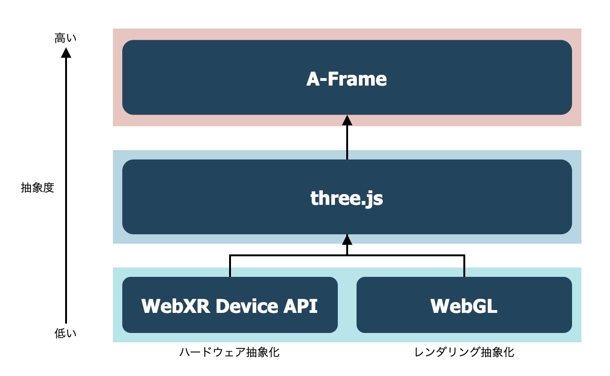

# タイトル

## これは何？

この記事は[DMMグループ Advent Calendar 2020](https://qiita.com/advent-calendar/2020/dmm)の14日目の投稿です。

業務でWebVRに触る機会があり、おもしろいと思ったので布教の意味も込めて本記事を書きました！
読み終えた後にはWebVRの基本を分かったような気になれる、、ようがんばります。

また本記事は、Webの3Dプログラミングにはじめて触れる方を対象としています。


## WebVRとは

WebVRとは、WebブラウザにおけるVR技術の標準化を目指して2014年に提唱された概念です。
2016年にはversion 1.0のWebVR APIがリリースされています。

最近色々と変遷があったり、そもそも他のWeb3D技術との関連性もわかりにくいので、まずそのあたりを説明します。


### WebARとの統合

WebVR APIは最近、WebARを取り込む形で[WebXR Device API](https://developer.mozilla.org/ja/docs/Web/API/WebXR_Device_API)へと統合されました。

Deviceとあるのは、このAPIはOculus Questなどのヘッドマウントデバイスをjavascriptから操作するためのハードウェアの抽象化を主に担っているからです。

グラフィックのレンダリング部分に関してはWebGLを使っているそうです（以下引用より）


> ### WebGL and WebXR API - how do they relate?
>
> How does the rendering engine, such as WebGL relate to WebXR device API? WebGL is a graphics language that takes imperative data and turns it into pixels on a screen. WebXR manages the context and provides the information to WebGL on 'where' and 'how' to draw those pixels. WebXR uses WebGL as its rendering mechanism, but that alternative mechanisms may be supported in the future (i.e., this is an intentional point of extensibility).
>
> [WebXR Standards and Accessibility Architecture Issues](https://www.w3.org/WAI/APA/wiki/WebXR_Standards_and_Accessibility_Architecture_Issues#WebGL_and_WebXR_API_-_how_do_they_relate.3F)


WebVR API自体はブラウザのサポートが切られているため、今後WebVR開発を行う場合にはWebXRを使うことになります。
（次に説明するthree.jsやA-Frameを使う分には、この辺りの違いを意識する必要はありません。）


### 他のライブラリとの関係

WebXR Device APIやWebGLを直接扱う場合、行列計算などの割と高度な数学や物理の知識を要求されます。
そこで、さらに上の抽象レイヤーとして `three.js` というOSSのライブラリが作られています。
three.jsを使えば数十〜数百行のコードでWebの3D表現が作れます。

そして、さらに抽象化したラッパーライブラリとして、`A-Frame`が誕生しました。
three.jsも十分直感的ですが、A-Frameを使えばhtmlのみで3D表現ができてしまいます。

以上のライブラリ群の関係性を図にするとこんな感じです。



ちなみに、少し前にWebVRを触ったことのある人は`React360`というライブラリを使ったことがあるかもしれません。
React360は執筆時点ではWebXRに対応しておらず、開発もほとんど停滞しているようです。（おそらく滅びたようです）

では実際に`three.js`と`A-Frame`に少し触ってみましょう！


## ハンズオン

少しでも理解しやすいよう、簡単なハンズオンを用意しました！
執筆時点のバージョンは以下です。

- [three.js](https://threejs.org/) r123
- [A-Frame](https://aframe.io/) v1.0.4


### three.js編

最初にthee.jsをCDN経由で読み込み、3Dを表示する先のキャンバスとなるdivタグを作ります。

```html:index.html
<html>
  <head>
    <script src="https://cdnjs.cloudflare.com/ajax/libs/three.js/r123/three.min.js"></script>
  </head>
  <body>
    <div id="canvas"></div>
    <script>
      <!-- ここにthree.jsのコードを実装していきます。 -->
    </script>
  </body>
</html>
```

three.jsでは基本的に以下の要素を実装することになります。

- scene ルートとなる3Dシーン
- camera カメラの位置や種類
- object 表示したい3Dオブジェクトの形状や材質
- light 光源の位置や種類
- renderer 3D空間の情報を2Dのキャンバスに投影するレンダラー

そして最後にVRヘッドセットへのレンダリング処理を追加することでWebVRが実現されます。


では、以下のような感じでそれぞれ関数に分けて実装していきたいと思います。

```html:index.html
<script>
  function init() {
    createScene()
    createCamera()
    createObject()
    createLight()
    createRenderer()
    
    // 描画メソッド
    render()
  }
</script>

```


### scene

シーンを作るのは簡単です。

```html:index.html
<script>
  ~ 省略 ~
  
  var scene

  function createScene() {
    scene = new THREE.Scene()
  }
</script>

```

### camera

続いてカメラを作ります。カメラは一番基本的な遠近感のある`PerspectiveCamera`を用います。
コンストラクターには、視野角（fieldOfView）、アスペクト比の他に、クリッピングの設定値を渡します。

クリッピングとはパフォーマンス向上のための機能で、要は遠すぎor近すぎなオブジェクトを描画しないようにするものです。
nearとfarの値を設定します。

以下の図を見るとなんとなくわかると思います。


```html:index.html
<script>
  ~ 省略 ~
  
  var camera

  function createCamera() {
    camera = new THREE.PerspectiveCamera(
      45, # fieldOfView
      window.innerWidth / window.innerHeight, # aspectRatio
      1, # nera
      10000 # far
    )
  }
</script>

```

### object

次に表示したい物体を作成します。
今回はお寿司を作ってみましょう。


### threejsにおけるvr対応 
https://ics.media/entry/18793/

## ハンズオン2: A-Frame
### aframeで同じことをやる
### コンポーネント実装

## まとめ

## 参考サイト
https://note.com/misaki_mofu/n/n21dccbabae20
https://tympanus.net/codrops/2016/04/26/the-aviator-animating-basic-3d-scene-threejs/
https://thebookofshaders.com/02/?lan=jp
https://www.clicktorelease.com/blog/vertex-displacement-noise-3d-webgl-glsl-three-js/