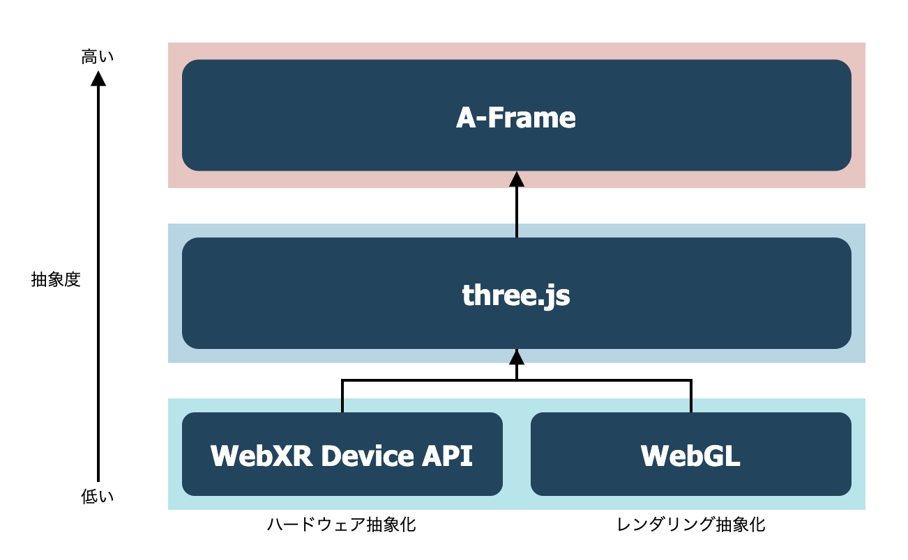

# A-FrameはWebVRをどれほど手軽にしたか


## これは何？

この記事は[DMMグループ Advent Calendar 2020](https://qiita.com/advent-calendar/2020/dmm)の14日目の投稿です。

業務でWebVRに触る機会があり、おもしろいと思ったので布教の意味も込めて本記事を書きました！

three.jsとA-Frameでの実装の比較によって、WebVRがどれほど手軽になったのかを説明します。
読み終えた後にはWebVRの基本も身につく、、といいなぁ。

また本記事は、Webの3Dプログラミングにはじめて触れる方を対象としています。


## WebVRとは

WebVRとは、WebブラウザにおけるVR技術の標準化を目指して2014年に提唱された概念です。
2016年にはversion 1.0のWebVR APIがリリースされています。

最近色々と変遷があったり、そもそも他のWeb3D技術との関連性もわかりにくいので、まずそのあたりを説明します。


### WebARとの統合

WebVR APIは最近、WebARを取り込む形で[WebXR Device API](https://developer.mozilla.org/ja/docs/Web/API/WebXR_Device_API)へと統合されました。

Deviceとあるのは、このAPIはOculus Questなどのヘッドマウントデバイスをjavascriptから操作するためのハードウェアの抽象化を主に担っているからです。

グラフィックのレンダリング部分に関してはWebGLを使っているそうです（以下引用より）


> ### WebGL and WebXR API - how do they relate?
>
> How does the rendering engine, such as WebGL relate to WebXR device API? WebGL is a graphics language that takes imperative data and turns it into pixels on a screen. WebXR manages the context and provides the information to WebGL on 'where' and 'how' to draw those pixels. WebXR uses WebGL as its rendering mechanism, but that alternative mechanisms may be supported in the future (i.e., this is an intentional point of extensibility).
>
> [WebXR Standards and Accessibility Architecture Issues](https://www.w3.org/WAI/APA/wiki/WebXR_Standards_and_Accessibility_Architecture_Issues#WebGL_and_WebXR_API_-_how_do_they_relate.3F)


WebVR API自体はブラウザのサポートが切られているため、今後WebVR開発を行う場合にはWebXRを使うことになります。
（次に説明するthree.jsやA-Frameを使う分には、この辺りの違いを意識する必要はありません。）


### 他のライブラリとの関係

WebXR Device APIやWebGLを直接扱う場合、行列計算などの割と高度な数学や物理の知識を要求されます。
そこで、さらに上の抽象レイヤーとして `three.js` というOSSのライブラリが作られています。
three.jsを使えば数十〜数百行のコードでWebの3D表現が作れます。

そして、さらに抽象化したラッパーライブラリとして、`A-Frame`が誕生しました。
three.jsも十分直感的ですが、A-Frameを使えばhtmlのみで3D表現ができてしまいます。

以上のライブラリ群の関係性を図にするとこんな感じです。



ちなみに、少し前にWebVRを触ったことのある人は`React360`というライブラリを使ったことがあるかもしれません。
React360は執筆時点ではWebXRに対応しておらず、開発もほとんど停滞しているようです。（おそらく滅びたようです）

では実際に`three.js`と`A-Frame`に少し触ってみましょう！


## ハンズオン

エンジニアはコードで語れ！ということで、簡単なハンズオンを用意しました。
執筆時点のバージョンは以下です。

- [three.js](https://threejs.org/) r123
- [A-Frame](https://aframe.io/) v1.1.0

一応リポジトリも置いておきます。
<a href="https://github.com/inoue0124/webxr-handson"></a>

### three.js編

まずはthree.jsです。
最初にコード全体を示します！

```html:three.html
<html>
  <head>
    <script src="https://cdnjs.cloudflare.com/ajax/libs/three.js/r123/three.min.js"></script>
    <script src="./VRButton.js"></script>
    <style>
      #canvas {
        width: 100%;
        height: 100%;
      }
    </style>
  </head>
  <body>
    <div id="canvas"></div>
    <script>
      window.addEventListener('load', init, false)

      let scene, camera, renderer
      let geometry, material, mesh

      function init() {
        createScene()
        createCamera()
        createLight()
        createObject()
        createRenderer()

        // 描画メソッド
        render()
      }

      function createScene() {
        scene = new THREE.Scene()
      }

      function createCamera() {
        // (fieldOfView, aspectRatio, near, far)
        camera = new THREE.PerspectiveCamera(90, window.innerWidth / window.innerHeight, 1, 10000)
        camera.position.z = 3
      }

      function createLight() {
        const dirLight = new THREE.DirectionalLight(0xFFFFFF, 0.5)
        dirLight.position.set(1, 10, 10)
        
        const ambLight = new THREE.AmbientLight(0x4CC3D9);
        
        scene.add(dirLight, ambLight)
      }

      function createObject() {
        geometry = new THREE.BoxGeometry()
        material = new THREE.MeshLambertMaterial({color: 0x4CC3D9})
        mesh = new THREE.Mesh(geometry, material)
        scene.add(mesh)
      }

      function createRenderer() {
        renderer = new THREE.WebGLRenderer({
          alpha: true,
          antialias: true
        })
        renderer.setSize(window.innerWidth, window.innerHeight)
        document.getElementById('canvas').appendChild(renderer.domElement)
        document.body.appendChild( VRButton.createButton(renderer))
        renderer.xr.enabled = true;
      }

      function render() {
        renderer.render(scene, camera)
        mesh.rotation.z += 0.02
        mesh.rotation.y += 0.02
        renderer.setAnimationLoop(render)
      }
    </script>
  </body>
</html>
```

これを実行するとこんな感じになります。
<p class="codepen" data-height="400" data-theme-id="light" data-default-tab="result" data-user="inoue0124" data-slug-hash="QWKdWyG" style="height: 359px; box-sizing: border-box; display: flex; align-items: center; justify-content: center; border: 2px solid; margin: 1em 0; padding: 1em;" data-pen-title="threejs-example">
  <span>See the Pen <a href="https://codepen.io/inoue0124/pen/QWKdWyG">
  threejs-example</a> by Yusuke Inoue (<a href="https://codepen.io/inoue0124">@inoue0124</a>)
  on <a href="https://codepen.io">CodePen</a>.</span>
</p>
<script async src="https://cpwebassets.codepen.io/assets/embed/ei.js"></script>


かわいいかわいい箱が現れました！
とっても簡単ですね！

では早速、解説していきたいと思います！


#### 解説

最初にthee.jsをCDN経由で読み込み、3Dを表示する先のキャンバスとなるdivタグを作ります。

```html:three.html
<head>
  <script src="https://cdnjs.cloudflare.com/ajax/libs/three.js/r123/three.min.js"></script>
</head>
  <body>
    <div id="canvas"></div>
    <script>
     // ここからthree.jsのコード
```

three.jsでは基本的に以下の要素を実装することになります。

- `scene` ルートとなる3Dシーン
- `camera` カメラの位置や種類
- `light` 光源の位置や種類
- `object` 表示したい3Dオブジェクトの形状（`geometry`）や材質（`material`）
- `renderer` 3D空間の情報を2Dのキャンバスに投影するレンダラー

そして最後にVRヘッドセットへのレンダリング処理を追加することでWebVRが実現されます。

それぞれ詳しく見ていきましょう。


#### scene

シーンを作るのは簡単です。
THREE.Scene()でインスタンス化してあげるだけです。

```html:three.html
function createScene() {
  scene = new THREE.Scene()
}
```


#### camera

続いてカメラを作ります。カメラは一番基本的な遠近感のある`PerspectiveCamera`を用います。
コンストラクターには、視野角（fieldOfView）、アスペクト比の他に、クリッピングの設定値を渡します。

クリッピングとはパフォーマンス向上のための機能で、要は遠すぎor近すぎなオブジェクトを描画しないようにするものです。
nearとfarの値を設定します。

以下の図を見るとなんとなくわかると思います。


```html:three.html
function createCamera() {
  // (fieldOfView, aspectRatio, near, far)
  camera = new THREE.PerspectiveCamera(45, window.innerWidth / window.innerHeight, 1, 10000)
  camera.position.z = 3
}
```

カメラのz座標を3としているのは、0だと原点の位置でありオブジェクトと重なって見えなくなってしまうからです。
イメージとしては手前に3メートルだけ引いているイメージです。


#### light

次にライトを作成します。
ライトがないとオブジェクトを配置しても何も見えないので注意してください。

ここでは`DirectionalLight`と`AmbientLight`を配置します。

DirectionalLightは日本語で言うと平行光源で、太陽のような十分遠い位置にある光源からの光をシュミレートします。

AmbientLightはシーン全体を照らす環境光のようなものです。
シーン全体を均一に明るくしてくれます。

```html:three.html
function createLight() {
  const dirLight = new THREE.DirectionalLight(0xFFFFFF, 0.5)
  dirLight.position.set(1, 10, 10)
  
  const ambLight = new THREE.AmbientLight(0x4CC3D9);
  
  scene.add(dirLight, ambLight)
}
```

作成したライトをシーンに追加するのを忘れないようにしてください。


#### object

次に表示したい物体を作成します。
今回は基本の立方体、`Box`で行きます。

```html:three.html
function createObject() {
  geometry = new THREE.BoxGeometry()
  material = new THREE.MeshLambertMaterial({color: 0x4CC3D9})
  mesh = new THREE.Mesh(geometry, material)
  scene.add(mesh)
}
```

ここで注目したいのが、形状を決める`geometry`と、材質を決める`material`をそれぞれ定義し、それを組み合わせて`mesh`オブジェクトを生成しています。
3Dプログラミングで

three.jsでは、立方体や球、円柱など基本的なgeometryはあらかじめ用意されています。

またmaterialとしては、光をほとんど反射しない`MeshBasicMaterial`や、めっちゃ反射する`MeshPhongMaterial`などがあります。


#### renderer

最後にレンダリングを行うレンダラーオブジェクトを作成します。

```html:three.html
function createRenderer() {
  renderer = new THREE.WebGLRenderer({
    alpha: true,
    antialias: true
  })
  renderer.setSize(window.innerWidth, window.innerHeight)
  document.getElementById('canvas').appendChild(renderer.domElement)
}
```

レンダラーにサイズを設定し、canvasに追加するのを忘れないようにしてください。


#### レンダリング

ここまで準備してやっとレンダリングができる状態になりました。
先ほど作成したレンダラーオブジェクトを再帰的に呼び出します。


```html:three.html
function render() {
  renderer.render(scene, camera)
  mesh.rotation.z += 0.02
  mesh.rotation.y += 0.02
  requestAnimationFrame(render)
}
```

ここでmeshのrotation（回転）座標をいじることで、立方体が回転する表現をしています。

さて、最後にこれをVR対応させたいと思います。


#### threejsにおけるVR対応

VR対応は、こちらの[公式ドキュメント](https://threejs.org/docs/#manual/en/introduction/How-to-create-VR-content)にしたがってやれば簡単にできます。

まず、VRButtonをgithubのexampleから[ダウンロード](https://github.com/mrdoob/three.js/blob/master/examples/jsm/webxr/VRButton.js)します。

そしてそれをインポートしてbodyに突っ込みます。

```three.html
document.body.appendChild( VRButton.createButton(renderer))
```

またレンダラーのxrモードをenableにします。

```three.html
renderer.xr.enabled = true;
```

あとは、さきほど一番最後のrender関数で`requestAnimationFrame(render)`としていたところを、`renderer.setAnimationLoop(render)`としてあげると、rendererがよしなにVR・2Dの描画を切替えてくれます。

以上の実装をまとめるとレンダリング部分は以下のようになります。

```three.html
function createRenderer() {
  renderer = new THREE.WebGLRenderer({
    alpha: true,
    antialias: true
  })
  renderer.setSize(window.innerWidth, window.innerHeight)
  document.getElementById('canvas').appendChild(renderer.domElement)
  document.body.appendChild(VRButton.createButton(renderer)) // 追加
  renderer.xr.enabled = true // 追加
}

function render() {
  renderer.render(scene, camera)
  mesh.rotation.z += 0.02
  mesh.rotation.y += 0.02
  renderer.setAnimationLoop(render) // 変更
}
```

なお実際にQuestで試す場合には、ローカルでサーバを立ててQuest browserからアクセスしてください。
VS Codeを使っているなら、[Live Server](https://marketplace.visualstudio.com/items?itemName=ritwickdey.LiveServer)がオススメです！

SSLでないとQuestからアクセスできないため、オレオレ証明書の作成もお忘れなく。


### A-Frame編

続いてA-Frameでの実装を見ていきましょう！
といっても、A-Frameでは以上の実装をたったこれだけで完結させてしまいます。

```aframe.html
<html>
  <head>
    <script src="https://aframe.io/releases/1.1.0/aframe.min.js"></script>
  </head>
  <body>
    <a-scene>
      <a-box position="0 1 -3" rotation="0 45 0" color="#4CC3D9"></a-box>
    </a-scene>
  </body>
</html>
```

<p class="codepen" data-height="400" data-theme-id="light" data-default-tab="result" data-user="inoue0124" data-slug-hash="QWKdwbr" style="height: 419px; box-sizing: border-box; display: flex; align-items: center; justify-content: center; border: 2px solid; margin: 1em 0; padding: 1em;" data-pen-title="aframe-example">
  <span>See the Pen <a href="https://codepen.io/inoue0124/pen/QWKdwbr">
  aframe-example</a> by Yusuke Inoue (<a href="https://codepen.io/inoue0124">@inoue0124</a>)
  on <a href="https://codepen.io">CodePen</a>.</span>
</p>
<script async src="https://cpwebassets.codepen.io/assets/embed/ei.js"></script>

ビューティフォー！ですよね。
たった一行ですべてのオブジェクトの配置と、VR対応までやってくれます。

さらに、方向キーでの移動やマウスによるカメラ操作もできます。

**three.jsなんていらんかったんや**
（three.jsのラッパーなので、three.jsの知識があればより柔軟なカスタマイズができます。）


## まとめ

本記事ではA-Frameによって3D、およびWebVRがどれほど簡略化されたのかをハンズオンを通して見てみました。

まずはちょーお手軽に入門してみて、色々と遊んでみたらいいと思います。

今後もっと難しいことをやりたくなってきた場合にも、A-Frameにはコンポーネントという概念があって拡張しやすい作りになっています。

また3Dエンジニアはシェーダーを自作してやっと一人前みたいなところもありますが、A-FrameでももちろんWebGLで書いたシェーダーを適用できます。

年末年始のお遊びにはちょうど良いネタかと思いますので、ぜひ！


## 参考サイト
https://ics.media/tutorial-three/quickstart/
